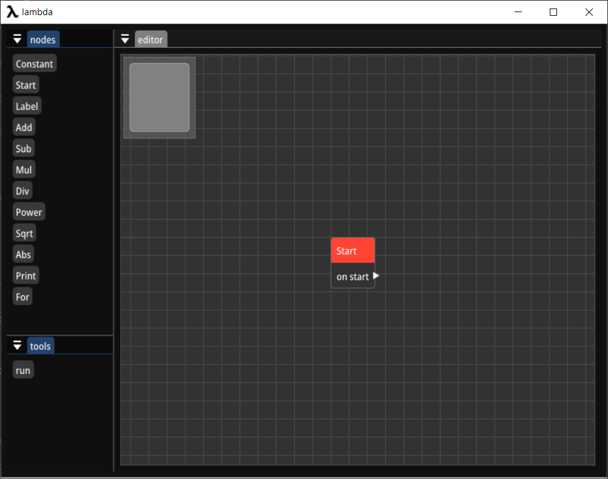
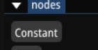
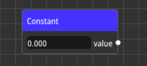
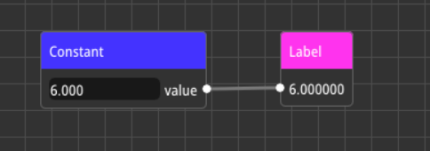
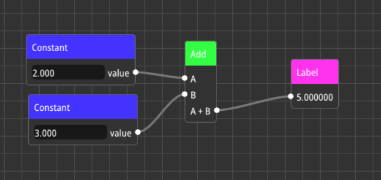

# Getting started

in this page you will learn how to use lambda!

## Installation

first go to https://github.com/arshavirmirzakhani/lambda and download latest version lambda from releases tab

## First look

when you open lambda you should see somthing like this :

- on left you see the nodes tab , you can create nodes by clicking the buttons
- on right you see the editor , this is where you use nodes

## Basic concept

lets create our first flow that gets two number as input and adds them then shows the result
to do that first click on "Constant" button to create a Constant node

now you should see the constant node on editor

in lambda each node represent an operation. nodes can be connected to each other from ports using links , for example you can connect a constant node to an label node like the image below :

when an node output port connect to another node input port , the value of input will be set to value of the output.

## Make your first basic flow

now lets make a flow that adds two number and show the result

here are the steps with explanation :

### create two constant node

constant node are used to output numerical values

### create an add node

this node is used two add two values

### connect one constant node to first pin and connect another one to second pin

now we created a flow that adds two number now lets output the value

### create an label node and connect it to output of the add node 

label node id used to see output of nodes

now you should see somthing like this :

## shortcuts

here some short cuts in lambda :

<kbd>C</kbd> copy nodes

<kbd>V</kbd> paste nodes

<kbd>Del</kbd> delete nodes/links
